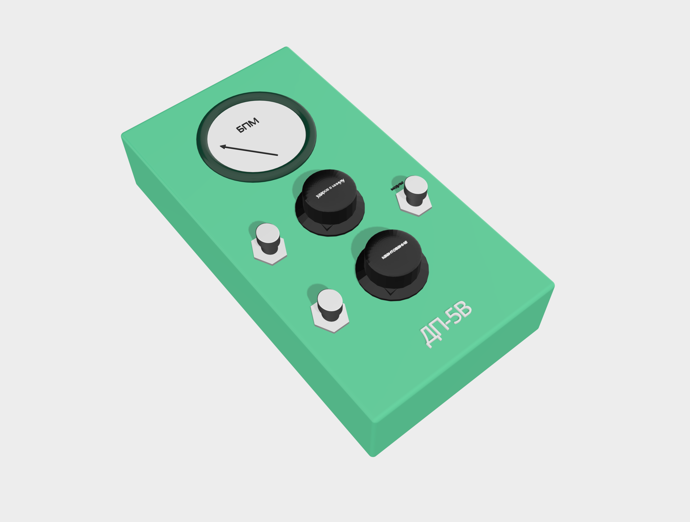

# ДП-5В

The DP-5V (ДП-5В) is a MIDI device that generates MIDI signals from radiation using an internal geiger counter. It is named after, and takes design inspiration from, the famous Soviet geiger counter used by Chernobyl liquidators in 1986.

## Features

For ease of use, the DP-5V has just 2 settings.

### Quantization

When turned on, notes can be quantized to whole note, half note, quarter note, eighth note all the way up to 128th notes. When the Geiger Counter receives a signal, it waits in a buffer until the note can be triggered.

### Modulo Gate

When the modulo gate is off, every second signal is a note off of the previous signal. When the modulo gate is set to on, each signal acts as both a note off for the previous note, and a note on for the current note.

## Render

